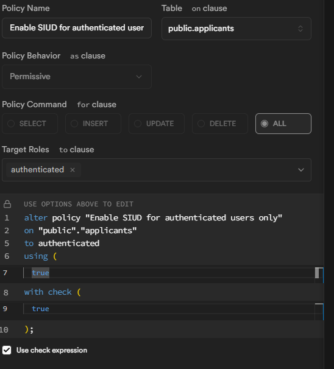

# 🧠 JobBoard Admin: Jobs Management Dashboard & Applicant Parser

A full-stack recruitment dashboard demo that parses email-based job applications, extracts applicant data (including CVs and cover letters), stores and scores them intelligently, and allows admins to manage and communicate with candidates — all from a unified Supabase-powered UI.

There's a demo app to view the jobs:
- https://site-jobs.netlify.app
- https://github.com/arndom/job-board-site

---

## ✨ Features

- 📥 **Email-Based Applications**
  Applicants apply via email to dynamic addresses like `xcxcxc@{custom.domain.com}`.

- 🔐 **DKIM, Return-Path, and MX Setup**
  Fully authenticated sending and receiving under a custom subdomain.

- 🧠 **AI-Powered Parsing & Scoring**
  Cloudflare Workers + LLM extract:
  - Timezone & location
  - Trust score (e.g., LinkedIn, GitHub presence)
  - Seniority level
  - Sentiment analysis (CV, cover letter)
  - Match % with job description

- 📂 **Supabase Storage Integration**
  Stores and retrieves uploaded CVs and cover letters.

- 📊 **Admin Dashboard UI**
  Built with Refine + Material UI:
  - View all jobs, applicants, applications
  - Track trust score, match %, sentiment
  - Manage job listings
  - View detailed applications and attachments

- 📧 **Two-Way Email Communication**
  Admins can email applicants from the dashboard.
  Replies are parsed back into threaded message logs per application.

---

## ⚙️ Tech Stack

- 🧱 **Supabase** (Auth, DB, Storage, Edge Functions)
- 📨 **Postmark** (inbound & outbound email)
- 🔎 **Cloudflare worker AI + Olama model** (LLM enrichment)
- 📄 **pdf2json + mammoth** (document parsing)
- 💻 **[Refine](https://github.com/refinedev/refine) + Material UI** (admin interface)

---

## 🛠️ Local Setup
1. Create a `.env.local` file with:
```bash
NEXT_PUBLIC_SUPABASE_URL=...
NEXT_PUBLIC_SUPABASE_KEY=...
```
2. Define other env variables in your supabse dashboard under the edge functions secrets page:
```bash
SUPABASE_SERVICE_ROLE_KEY=... # this is predefined for you
POSTMARK_API_KEY=...
CLOUDFLARE_ACCOUNT_ID=...
CLOUDFLARE_API_TOKEN=...
```
3. For email functionality setup in Postmark with custom domain, follow these guide:
    - https://postmarkapp.com/developer/user-guide/inbound/configure-an-inbound-server
    - https://postmarkapp.com/developer/user-guide/inbound/inbound-domain-forwarding
4. When setting up Postmark, ensure your verify you custom domain for **DKIM, Return-Path**, this enables your outbound email to avoid entering spam or failed delivery.
5. For Cloudflare worker AI setup follow this guide
    - https://developers.cloudflare.com/workers-ai/
6. Supbase setup
    - **auth**
      - in your supabase dashboard create an auth user:
      ```json
        {
          email: "admin@jobboard.com",
          password: "demo-jobboard-admin",
        }
      ```
      - you can find its use here `/components/auth-page`
    - **database**
      ```bash
      cd src

      # connect your created supabase project
      supabase link

      # migrate the database and seed it
      npx supabase db reset
      ```
      - setup RLS for the tables in your dashboard - go to policies under authentication
      - apply policy command for tables: `applicants, applicatiions, emails`
      
      - the same applies to all actions for the `jobs` table except `SELECT`
      - `SELECT` is public to allow fetching of jobs on the demo job board site: https://site-jobs.netlify.app
    - **storage**
      - create a bucket named: `applicants-files`
      - leave it as private
      - allowed MIME types: `application/pdf, application/vnd.openxmlformats-officedocument.wordprocessingml.document`
    - **edge functions**
      ```bash
      cd src

      # deploy the functions
      npx supabase functions deploy
      ```
7. Run locally:
```bash
npm install
npm run dev
```
